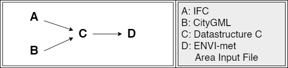
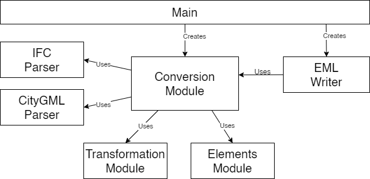
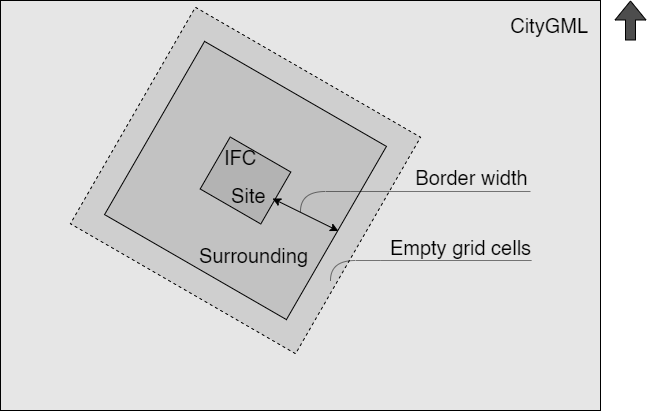

# Conversion tool: from IFC and CityGML to ENVI-met Area Input File
This tool is a prototype serving as proof of concept for research done for the MSc thesis: "[BIM and 3D City Models as Input for Microclimate Simulation](https://repository.tudelft.nl/islandora/object/uuid%3A630d57be-5660-4971-84c2-83bf12b1d204?collection=education) ".

## Research abstract
Climate change, and the effect it has on our lives and the world, has been at the centre of debate in the past decades. Also in architecture and urban planning fields, the effect of climate on buildings and cities has always had a role in the design process, nowadays especially when it comes to sustainability related topics. An interesting element within climate is the microclimate, which is a small area where climate circumstances are different then in the surrounding area. For example in an urban area the temperature difference between an area in a big city and the rural area around it can be up to 10°C, due to influences of surrounding buildings and materials. In the design process often more general weather data is used in calculation, this while they can differ a lot from reality. Modern tools make it possible to simulate the microclimate. One of these tools is ENVI-met. However, inputting 3D models into this software is mostly a manual process. This while a lot of information that is necessary is already available in existing architectural and urban design models. There is just no way to input this information into the software.

In this research a method is developed for combining detailed information from BIM models (IFC), with information about the surroundings from 3D City models (CityGML), and translating them to the ENVI-met format, so that these models can be used as input models for microclimate simulation in ENVI-met. This is done by creating a command line tool that extracts the necessary data from both input files, combining and converting it, and then writing it to a file in the ENVI-met format. Also guidelines and requirements for the input files will be established.

This is done by first establishing what information is necessary for microclimate simulation in ENVI-met and how this information needs to be represented, and then finding out where this information can be found in the intended input files, and how it is represented in there. From this can be concluded what information can be taken from which input file and the characteristics that are necessary for their correct use in the process can be established. Then the conversion tool itself can be developed, where the data is transformed to the same coordinate system and format, so that it can be combined and written to the ENVI-met format. In the last step the results are checked by doing a small case study and running the microclimate simulation. 

This way, IFC and CityGML models can be used as input for microclimate simulation software ENVI-met, by using the conversion tool developed for this research and the provided guidelines.

## Basic concept of the conversion tool
The conversion tool extracts the needed information from both IFC (A) and CityGML (B) and converts the data to one format stored in an intermediate datastructure (C). From this datastructure, the ENVI-met area input file is generated (D).



To achieve this the conversion tool consist of the following modules, as can be seen in thw figure below. In main the main modules are called and the user input is gathered, and supplied to these modules. The conversion module is the core of the tool. It uses IFC and CityGML parsers to extract information from the input modules. Converts the data using the transformation module that can transform between different spatial reference systems, and the elements module that provides an interface for the data structure where the information is stored. The finished data structure can than be used by the EML writer, to generate the ENVI-met area input file.



For the model space size the tool uses the size of the IFC model (bounding box) and adds a by the user specified surrounding area and empty grid cells around it. Only the CityGML objects within this model space will be converted. The height of the model is twice as high as highest building within the model area.



## Setup
There is probably more then one way to set everything up, but the following setup works with all the needed libraries and dependencies.
To be able to run the program, the following is required. An Anaconda environment with Python 3.8 installed and the following libraries and their dependencies: 
- GDAL
- pythonOCC-core
- IfcOpenShell
- shapely
- lxml
- reverse-geocode
- timezonefinder

Other required modules like NumPy, xml and math should already be included in the Anaconda or Python installation.
The program can be run from a python IDE where an Anaconda (virtual) environment can be set up (like PyCharm), or can be run directly from the Conda command line, by running main.py from the conversion tool directory.

To be able to check the conversion result, edit them and run the simulation, the ENVI-met software package needs to be installed.

## User input
The following information needs to be provided as arguments when the user calls the program:
- `--ifc`: Path to the input IFC model according to the guidelines.
- `--citygml`: Path to the input CityGML model, meeting the requirements.
- `--output`: Location and file name of the output file (.inx file/area input file).
- `--borderwidth`: Size of the surrounding area around the IFC model, where information from CityGML will be used, in meters.
- `--resolution`: The resolution of the output model between 0.5 and 10 meters.
- `--bordergrid`: The number of empty gridcells surrounding the model

### Example
```
python main.py --ifc <input>.ifc --citygml <input>.gml --output <output>.INX --borderwidth 20.0 --resolution 1.0 --bordergrid 10
```


## Guidelines for input models
### IFC
The following guidelines and requirements are set up for the designer of the input IFC model:

- *Record a reference point to (0,0,0) in WGS84 in the latitude, longitude and elevation attributes of IfcSite. Also correctly note the rotation to North in the attribute TrueNorth found in RepresentationContext in IfcProject* \- It is really important that the IFC model is georeferenced properly, to be able to use it in the conversion tool. Also very important is how the model is rotated with respect to the North, to be able to link the model to the real world.
- *Add some form of a terrain model to the attribute Representation in IfcSite* \- The x- and y-coordinates of the bounding box of the site representation are used to decide on the size of the generated ENVI-met area input file. Therefore this needs to be defined in the model. It can be in the most simple form, for example a square. 
- *Store only one building in the IFC File* \- The IFC model includes one building. In case of multiple buildings they will be labelled as one building in ENVI-met.
- *Use millimetres (mm) as the unit in the IFC file* \- The conversion tool only handles the file if it is in millimetres.
- *Use the building entities IfcSlab and IfcRoof for all horizontal surfaces like floors and roofs. Set the property isExternal for external floors and roofs.* \-  The building entities IfcSlab and IfcRoof are used to extract a building from the model. These entities need to be properly used and assigned to the correct elements. The property isExternal helps knowing if an element is an external part of the building. When this property is correctly assigned, only these outside floors and roofs have to be taken into account when generating the building for ENVI-met.

### CityGML
The following classes are required to be included in the CityGML model:
- *Relief:* The DEM of the CityGML is used to generate the DEM for the ENVI-met area input file.
- *Building:* The buildings from CityGML are used as surroundings/context in the ENVI-met area input file.

The next classes are nice to have in the CityGML model, and could provide for a great addition to the ENVI-met area input file:
- *Vegetation:* Both information about simple plants like grass and bushes (not implemented), as trees (implemented), could be extracted and added to the ENVI-met area input file.
- *Transportation:* The information about roads and pavements could be used to enrich the soil model the ENVI-met area input file (not implemented).
- *Waterbody:* Could be used to enrich the soil model of the ENVI-met area input file (not implemented).

At this point in time, the buildings can only be extracted from the lod2multisurface, so the buildings need to have this representation available. For the terrain height the TIN representation will be used.
Also the elements in the CityGML model need to be in the same SRS as the gml:Envelope. And the unit in meters.


*More detailed information about the tool and the research can be found in the corresponding [thesis](https://repository.tudelft.nl/islandora/object/uuid%3A630d57be-5660-4971-84c2-83bf12b1d204?collection=education).*